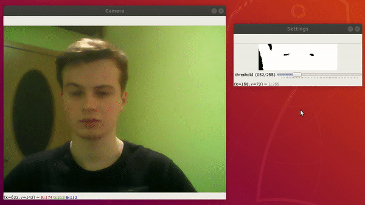

# Eye Tracker

It is a program for tracking and marking irises on webcam images.  
  
  
  
  

## Getting Started

These instructions will get you a copy of the project up and running on your local machine for development and testing purposes.

### Prerequisites

1. Webcam
2. Python 3
```
sudo apt-get update
sudo apt-get upgrade
sudo apt-get install python3.6
sudo apt-get install python3-pip
```

### Installing

Install the necessary dependencies:  
```
pip3 install -r requirements.txt
```

## Built With

* [Python 3](https://docs.python.org/3/) - The programming language
* [OpenCV](https://docs.opencv.org/4.1.1/d6/d00/tutorial_py_root.html) - Computer vision and machine learning software library
* [NumPy](https://numpy.org/doc/1.17/) - The package for scientific computing with Python

## Authors

* **Tomasz Strzoda** - [DrDEXT3R](https://github.com/DrDEXT3R)

## License

This project is licensed under the GNU General Public License v3.0 - see the [LICENSE](https://github.com/DrDEXT3R/CLP-Calculator/blob/master/LICENSE) file for details
