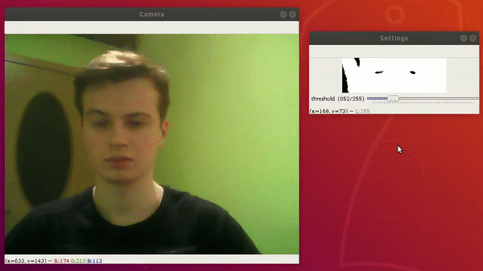

# Eye Tracker

It is a program for tracking and marking irises on webcam images. Due to the possibility of adjusting the threshold value in the settings window, the application works correctly in different lighting conditions. All tests were carried out on an average webcam (0.3 MP) embedded in a laptop computer. 
  
## Demo

  
  
  

## Getting Started

These instructions will get you a copy of the project up and running on your local machine for development and testing purposes.

### Prerequisites

1. Webcam
2. Python 3
```
sudo apt-get update
sudo apt-get upgrade
sudo apt-get install python3.6
sudo apt-get install python3-pip
```

### Installing

Install the necessary dependencies:  
```
pip3 install -r requirements.txt
```

### Settings

After starting the program, set the threshold value in the settings window in such a way as to best isolate the irises from the rest of the body. The threshold value depends on the conditions under which the program is run, therefore it affects the program operation.


## Built With

* [Python 3](https://docs.python.org/3/) - The programming language
* [OpenCV](https://docs.opencv.org/4.1.1/d6/d00/tutorial_py_root.html) - Computer vision and machine learning software library
* [NumPy](https://numpy.org/doc/1.17/) - The package for scientific computing with Python

## Authors

* **Tomasz Strzoda** - [DrDEXT3R](https://github.com/DrDEXT3R)

## License

This project is licensed under the GNU General Public License v3.0 - see the [LICENSE](https://github.com/DrDEXT3R/EyeTracker/blob/master/LICENSE) file for details.
